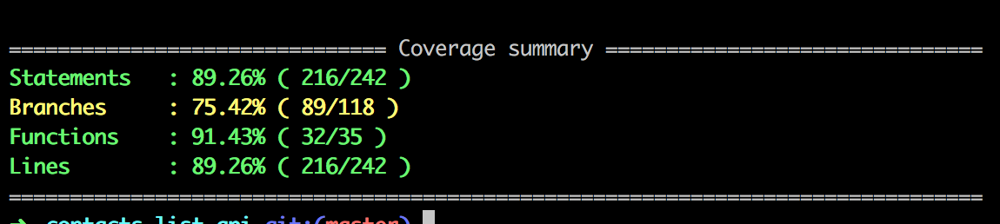

# Contacts List  RESTfull API

This sample project will give you simple login with username, password and social platforms

### Contact List Web Client

https://github.com/narg/contacts-list

## Pre-requisites

To get started, you'll need to have the following requirements installed

- Git
- Node.js1
- npm
- MongoDB 2.6.x / 3.2.x2

1See https://nodejs.org/

2See https://docs.mongodb.com/manual/administration/install-community/ for installation guides

## Getting started
	
	# Ensure `mongod` is running, either as a service or in another shell
	git clone <this repo>
	# Ensure config/config.json is updated
	cp config/config.sample.json config/config.json
	# Install npm dependencies
	npm install
	# Optional: Seed the DB with local users
	npm run seed
	# Run project
	npm start

## Running tests

Test Coverage Summary

`npm test`

## Running coverage report

`npm run coverage-ui`

## Running Sonar Report

*See http://www.sonarqube.org/

`sonar-runner`

## Running linter report

`npm run lint`

## API documentation

See [API.md](API.md) for details.
